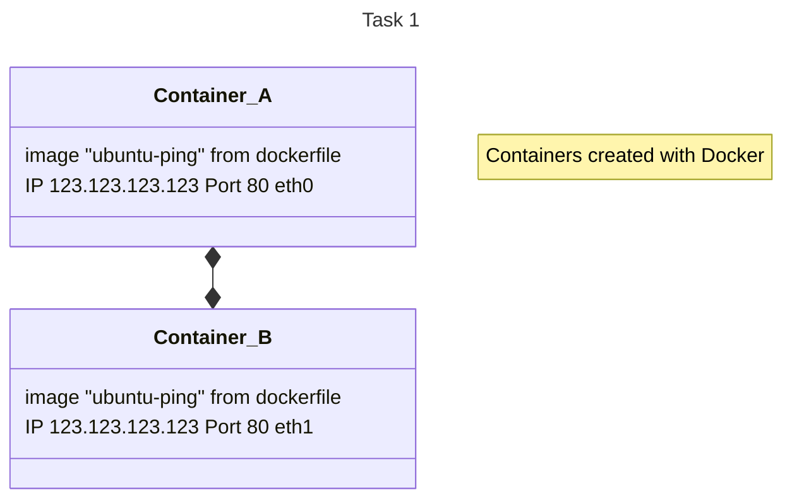

# Solution to Task 1 "Ping A to B"

General hints:

- Machines need to be either a VM or docker container
- Script is need to create the setup, create and test network traffic, remove setup again
- No "manual" actions
- Scripts need to be stored in revision control system
- Documentation of every setup needed

