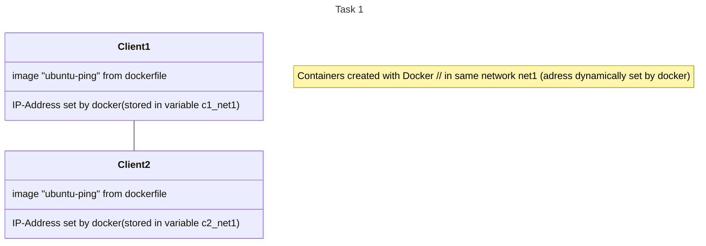

# Solution to Task 1 "Ping A to B"

General task:

Ping from A to B (Client1 - Client2)

```mermaid
---
title: Task 1
---
classDiagram
    note "Containers created with Docker // in same network net1 (adress dynamically set by docker)"
    Client1 -- Client2
    Client1 : image "ubuntu-ping" from dockerfile
    Client1 : IP-Address set by docker (stored in variable c1_net1)
    Client2 : image "ubuntu-ping" from dockerfile
    Client2 : IP-Address set by docker (stored in variable c2_net1)


```
