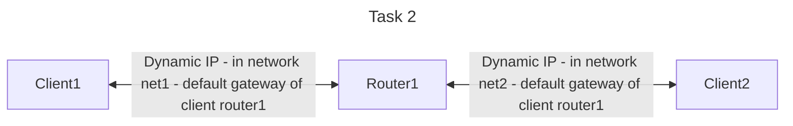

# Solution to Task 2 "Ping A to B over C"

General task:

Ping over a router (Router1) from Client1 to Client2 (C1 - R1 - C2)

## How does the script work?

Each container gets created within startPing1.sh, also the corresponding networks.
The containers get connected to each network.
The default gateway of each client(Client 1 + Client 2) is set to the router.
The IP-Addresses are retrived dynamically and dont have to be set by the user manually and stored
in variables.
Also an ping/traceroute are ran in startPing1.sh to each container to show the connection.

