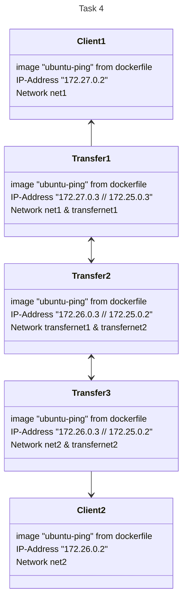

# Solution to Task 3 "Transfer Network"

Ping over two transfer networks between C D E from A to B (A-C-E-D-B). There is no knowledge about the transfer networks in A or B

## How does the script work?

Each container and network (and their relationship between each one) are configured within in docker-compose.yml file.
Containers are created with the cap-add NET_ADMIN and the ubuntu-ping image.
Networks are all of type BRIDGE.

